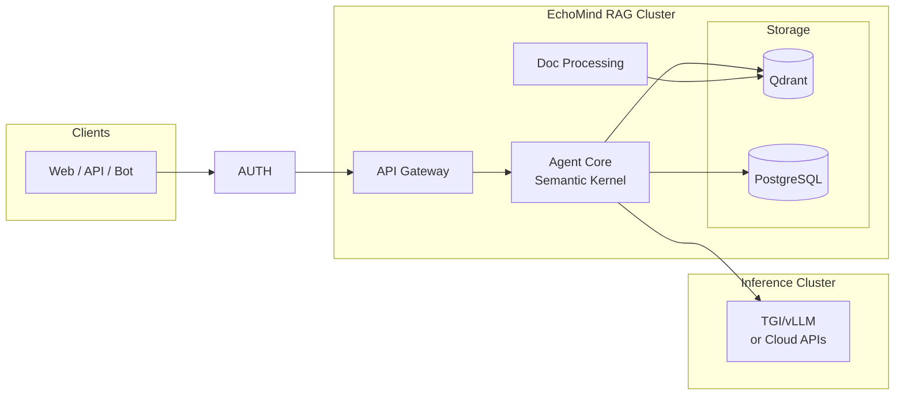

<div align="center">

# EchoMind

### OpenClaw for Business — With Zero Security Risk

[](https://www.python.org/)
[](license)
[](#deployment-modes)

**The power of personal AI assistants like OpenClaw — but for your entire organization.**<br/>
**Your company knowledge + your business tools. Fully sandboxed. Completely free.**

[Documentation](docs/architecture.md) · [Why EchoMind?](#why-echomind) · [OpenClaw vs EchoMind](#openclaw-vs-echomind)

</div>

---

## 🧠 What is it?

EchoMind brings the power of personal AI assistants to the enterprise — **without the security nightmares**.

Like [OpenClaw](https://openclaw.ai/), EchoMind is an AI agent that can access your data, execute workflows, and automate tasks. But instead of running with unrestricted access on personal devices, EchoMind runs in **isolated, ephemeral sandboxes** with enterprise-grade authentication and permission controls.

**EchoMind connects to:**
- **Organizational knowledge** — Teams, SharePoint, Google Drive, internal wikis, policies, and documents
- **Personal business tools** — Email, calendar, CRM, and the apps your teams use daily

> See [63 Supported Connectors](docs/personal-assistant/echomind-connectors.md) — including Salesforce, SAP, ServiceNow, Workday, and more.

**EchoMind is an AI agent** that **thinks** about what the workflow needs, **retrieves** the right internal context, **acts** using tools, then **verifies** the result — all within a secure, permission-aware sandbox.

> Built for real work: support automation, IT deflection, meeting follow-ups, contract review,
> AP/invoice handling, onboarding, and any process where the bottleneck is "finding the right info + doing the next step".

## 🔒 Secure by Design — Sandboxed Execution

Unlike personal AI assistants that run with full system access, EchoMind executes every workflow in an **ephemeral, isolated sandbox**:

| Security Feature | How It Works |
|------------------|--------------|
| **Ephemeral Sandboxes** | Each workflow runs in a fresh container that's destroyed after completion — no state leaks between runs |
| **Delegated Authorization** | Sandboxes call your tools with user-scoped tokens; permissions enforced at every layer |
| **No Direct System Access** | Workflows can't execute arbitrary shell commands on your infrastructure |
| **Lease-Based Execution** | Exclusive access with TTL prevents runaway processes and resource exhaustion |
| **Air-Gap Ready** | Deploy fully disconnected — no internet, no telemetry, no phone-home |

**The result:** Your teams get the productivity of an AI assistant. Your security team sleeps at night.

---

## ⚡ AI in Minutes (Not Months)

**Skip procurement. Start building today.**

No budget approvals. No vendor negotiations.
Deploy EchoMind now and ship your first internal AI workflow this week.

---
### 🤝 Need help getting started? Let’s jump on a quick call (free)

If you want a fast setup review, architecture feedback, or help choosing the right deployment mode,
you can book a **free call** with the author.

📅 [**Book a free call**](https://calendar.app.google/QuNua7HxdsSasCGu9) with [gsantopaolo](https://github.com/gsantopaolo)
---
## ✨ How it works

```
🔄 Think → Act → Observe → Reflect → Evaluate → Answer
```

> The agent 🤔 **thinks** about what information it needs, 👷‍♂️ **acts** by querying sources and tools, 🔍 **observes** the results, and 🤖 **reflects** on whether it has enough context. Before responding, it ⚖️ **evaluates** the quality and completeness of its answer — looping back if needed — then delivers a grounded 💬 **answer**.
## ⚙️ Automation Use Cases (Real-World Inspired)

EchoMind is built for *process automation*, not just Q&A:
**think → act → observe → reflect → evaluate → answer**, with permission-aware answers and source-grounded output.

### 🎧 Customer Support Automation
- Deflect repetitive chats and tickets with grounded answers from your KB and policies
- Escalate only complex cases with full context + suggested replies

### 📝 Meetings → Actions → Follow-ups → CRM
- Generate meeting notes + action items
- Draft follow-up emails
- Save structured notes into your CRM (e.g., Salesforce)

### 🧠 “Knowledge Coach” for Frontline Teams
- Make staff dramatically faster at finding the right internal info
- Serve answers grounded in policies, research, and product docs

### 🧰 IT Helpdesk Ticket Deflection (Shift-Left)
- Resolve common issues without creating tickets
- Pre-fill tickets only when needed (device, logs, steps tried)

### ⚖️ Contract Review Acceleration
- Extract key terms, flag risky clauses, summarize obligations
- Suggest redlines based on your playbooks and templates

### 🧾 Accounts Payable Automation
- Invoice extraction + coding suggestions
- Approval routing + audit-ready explanations

> **Deep Dive:** [Business Use Cases](docs/personal-assistant/echomind-use-cases-business-problems.md) — 4 productized solutions (SmartTicketing, DataInsight, OnboardingBot, CustomerContext360)
> | [Connector Use Cases](docs/personal-assistant/echomind-connector-use-cases.md) — 79 real-world workflows across 37 connectors

## 🚀 Why EchoMind?

**Enterprise AI assistants without the enterprise price tag — or the security risks.**

| Why It Matters | EchoMind Delivers |
|----------------|-------------------|
| **Free forever** | MIT licensed. $0. No usage caps. No "enterprise" tier. |
| **Secure by default** | Sandboxed execution, not "trust the user" security |
| **Your infrastructure** | Self-host on-prem, in your cloud, or air-gapped |
| **Your data stays yours** | No telemetry, no phone-home, no vendor lock-in |

---


## 🧬 What makes EchoMind agentic?
EchoMind is an **agentic RAG platform** that actually *thinks* before it retrieves — and it’s **100% free (MIT)** 🆓.

- **Reasons** about what information it needs before retrieving
- **Plans** multi-step retrieval strategies across multiple data sources
- **Uses tools** to execute actions, call APIs, and process data
- **Remembers** context across conversations with short-term and long-term memory

---
 
## Key Features

| Feature | Description |
|---------|-------------|
| **Agentic Architecture** | Think → Act → Observe → Reflect loop for intelligent retrieval |
| **Multi-Source Connectors** | [63 connectors](docs/personal-assistant/echomind-connectors.md) — Salesforce, SAP, Teams, Drive, and more |
| **Flexible Deployment** | Cloud, Hybrid, or fully Air-Gapped (SCIF compliant) |
| **Private LLM Inference** | TGI/vLLM for on-premise GPU clusters |
| **Enterprise Auth** | Authentik with OIDC/LDAP/Active Directory support |
| **Per-User Vector Collections** | Scoped search across user, group, and organization data |


|                                   |                                                                             |
|-----------------------------------|-----------------------------------------------------------------------------|
| 🔍 **Multi-Step Retrieval**       | Goes beyond "retrieve-then-generate" — reasons across multiple sources      |
| 🏠 **Private and SaaS LLM Ready** | Run with TGI/vLLM on your own GPU cluster or connected to your favorite LLM API |
| 🔒 **Air-Gap / SCIF Ready**       | No internet, no telemetry, no phone-home — fully self-contained             |
| 📦 **Deploy Anywhere**            | Single container to Kubernetes cluster — your choice                        |
| 🆓 **MIT Licensed — Free Forever** | No paid tiers. No usage caps. No hidden licensing surprises |


---

## Architecture Overview



For detailed architecture, see [docs/architecture.md](docs/architecture.md).

---

## Deployment Modes

EchoMind adapts to your security requirements:

| Mode | Description                                              | Use Case |
|------|----------------------------------------------------------|----------|
| **Cloud** | Deploy on your Could | Startups, teams without GPU infrastructure |
| **Hybrid** | Private RAG cluster + optional cloud LLM fallback        | Enterprises with sensitive data |
| **Air-Gapped** | Fully disconnected, zero external dependencies           | DoD, SCIF, classified networks |

### Air-Gapped / SCIF Compliance

EchoMind is designed for the most restricted environments:

- No internet access required
- No telemetry or phone-home capabilities
- All dependencies pre-packaged in container images
- Deployable to [Iron Bank (Platform One)](https://p1.dso.mil/iron-bank)
- LDAP/Active Directory integration via Authentik

---

## Tech Stack

| Component | Technology | Notes |
|-----------|------------|-------|
| Agent Framework | [Semantic Kernel](https://github.com/microsoft/semantic-kernel) | Microsoft's AI orchestration SDK |
| Vector Database | [Qdrant](https://qdrant.tech/) | High-performance, Rust-based |
| LLM Inference | TGI / vLLM | Private GPU cluster support |
| Auth | [Authentik](https://goauthentik.io/) | Self-hosted OIDC provider |
| API | FastAPI + WebSocket | Async, streaming responses |
| Message Queue | NATS JetStream | Lightweight, persistent |
| Metadata DB | PostgreSQL | Reliable, JSONB support |
| Object Storage | MinIO / RustFS | S3-compatible (evaluating RustFS) |

---

## Project Structure

```
echomind/
├── docs/                    # Documentation
│   └── architecture.md      # Technical architecture
├── src/
│   ├── api/                 # FastAPI application
│   ├── agent/               # Semantic Kernel agent core
│   ├── services/            # Background workers
│   ├── connectors/          # Data source connectors
│   ├── db/                  # Database clients
│   └── proto/               # Protocol Buffer definitions
│       ├── public/          # API objects (client-facing)
│       └── internal/        # Internal service objects
├── deployment/
│   ├── docker/              # Docker Compose files
│   └── k8s/                 # Kubernetes manifests
├── config/                  # Configuration files
└── tests/
```

> **Schema-First Development**: Proto definitions in `src/proto/` are the source of truth. CI generates TypeScript types (for clients) and Pydantic models (for Python) automatically.

---

## Contributing

We're building EchoMind in Python and welcome contributions in:

- **Backend**: FastAPI, async Python, gRPC
- **AI/ML**: Semantic Kernel, embeddings, reranking
- **Infrastructure**: Kubernetes, Docker, CI/CD
- **Connectors**: Microsoft Graph, Google APIs, and [60+ more](docs/personal-assistant/echomind-connectors.md)

---

## Documentation

- [Architecture](docs/architecture.md) - Technical design with Mermaid diagrams
- [Supported Connectors](docs/personal-assistant/echomind-connectors.md) - 63 data source integrations with market analysis
- [Business Use Cases](docs/personal-assistant/echomind-use-cases-business-problems.md) - Productized solutions for real business problems
- [Connector Use Cases](docs/personal-assistant/echomind-connector-use-cases.md) - 79 workflows showing what each connector enables
- API Documentation - *Coming soon*

---

## OpenClaw vs EchoMind

[OpenClaw](https://openclaw.ai/) is an open-source personal AI assistant that runs locally with full system access — shell commands, file operations, browser control. It's powerful for individuals, but [security researchers have flagged serious concerns](https://blogs.cisco.com/ai/personal-ai-agents-like-openclaw-are-a-security-nightmare) for organizational use: credential exposure, malicious skill injection, and no secure-by-default setup.

**EchoMind is OpenClaw for business** — the same AI agent capabilities, redesigned for enterprise security:

| Capability | OpenClaw | EchoMind |
|------------|----------|----------|
| AI-powered workflows | Personal device | Isolated sandbox |
| System access | Unrestricted shell/files | Permission-controlled APIs |
| Data sources | Local files, messaging apps | Org knowledge + business tools |
| Security model | User responsibility | Enterprise-grade (OIDC, LDAP, air-gap) |
| Execution environment | Persistent on device | Ephemeral containers |
| Target use case | Personal productivity | Team/org automation |
| Cost | Free + API costs | Free (MIT) + API costs |

**Bottom line:** If you want an AI assistant for personal use, OpenClaw is excellent. If you want to deploy AI assistants across your organization without creating security vulnerabilities, EchoMind is built for that.

---

## License

MIT License - See [LICENSE](license) for details.
