# EchoMind - Agentic RAG Architecture

> Technical specification for EchoMind, a Python-based Agentic Retrieval-Augmented Generation platform.

## Overview

EchoMind is an **Agentic RAG** system that goes beyond traditional retrieve-then-generate patterns. The agent reasons about what information it needs, plans multi-step retrieval strategies, uses external tools, and maintains memory across sessions.

---

## High-Level Architecture

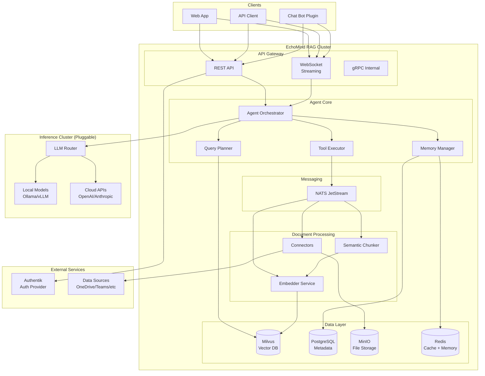

---

## Agentic RAG Flow

The key differentiator from traditional RAG: **the agent decides what to retrieve, when, and whether to retrieve at all**.

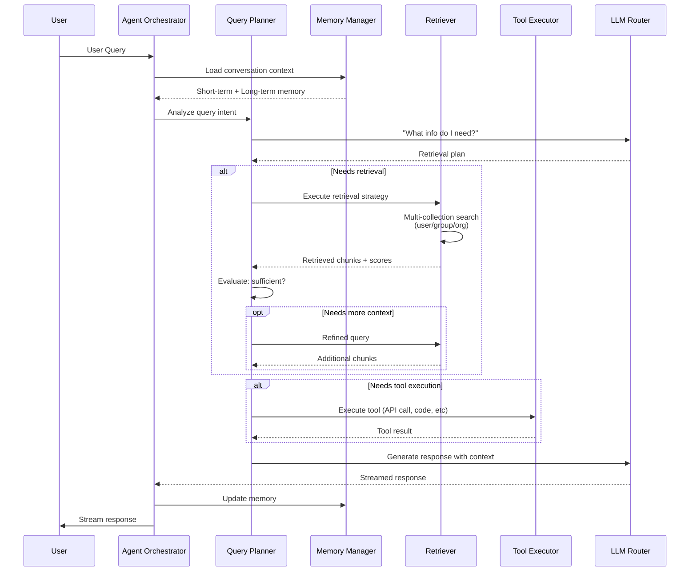

---

## Agent Planning Loop

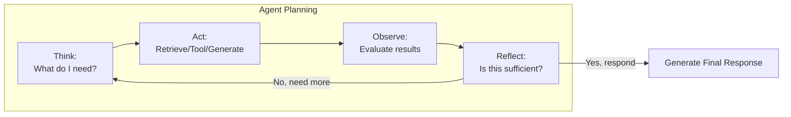

---

## Data Ingestion Pipeline

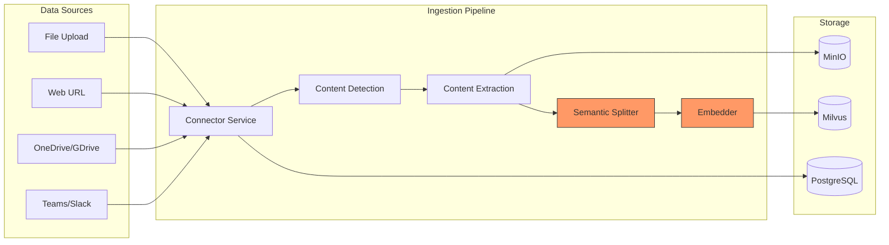

### Document Processing States

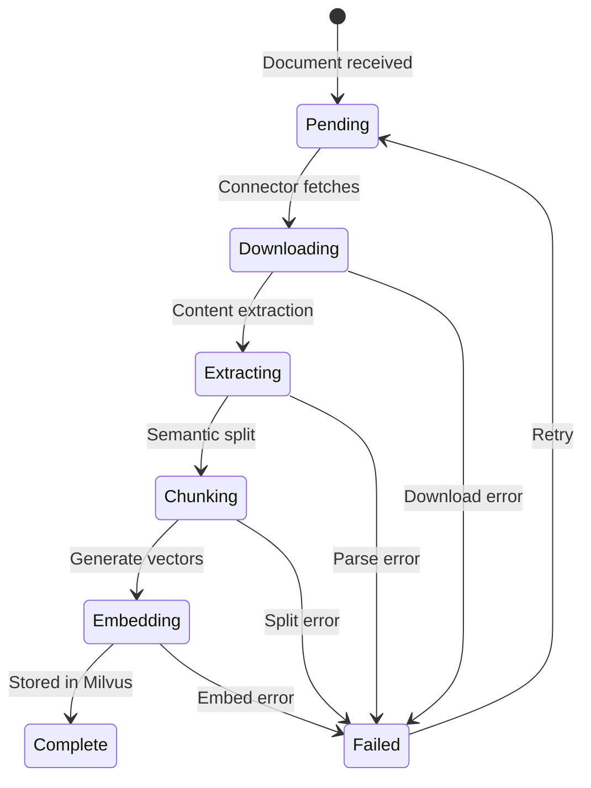

---

## Vector Collection Strategy

Per-user, per-group, and per-org collections enable scoped retrieval:

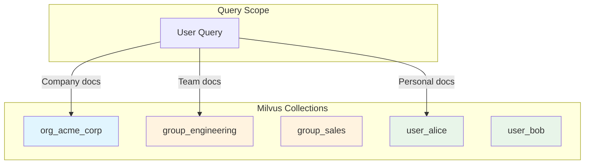

---

## Memory Architecture

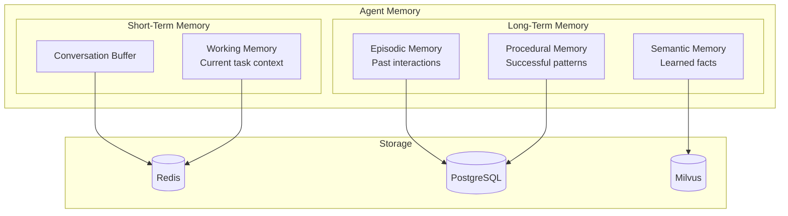

---

## Tool System

The agent can invoke tools during reasoning:

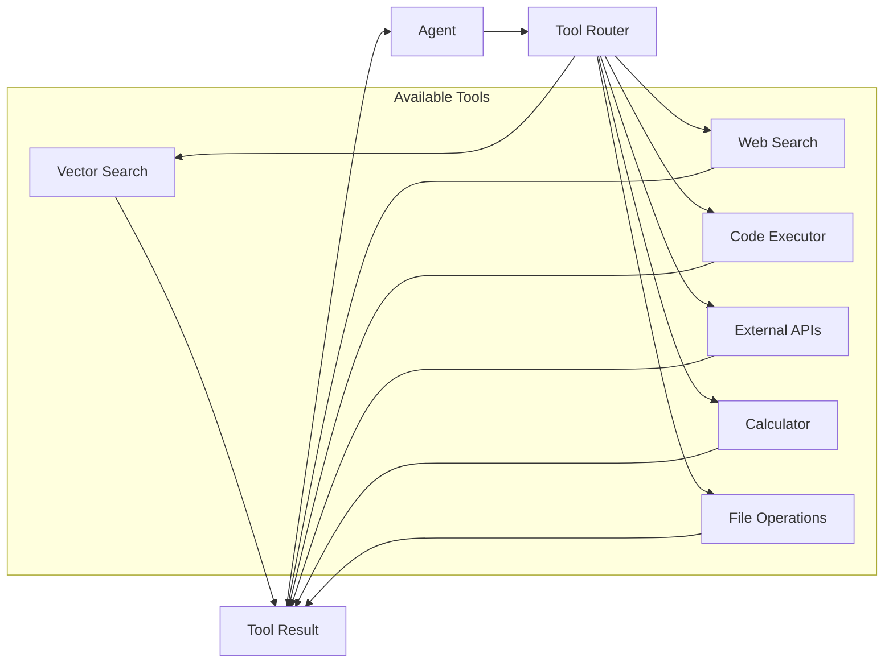

---

## Service Architecture

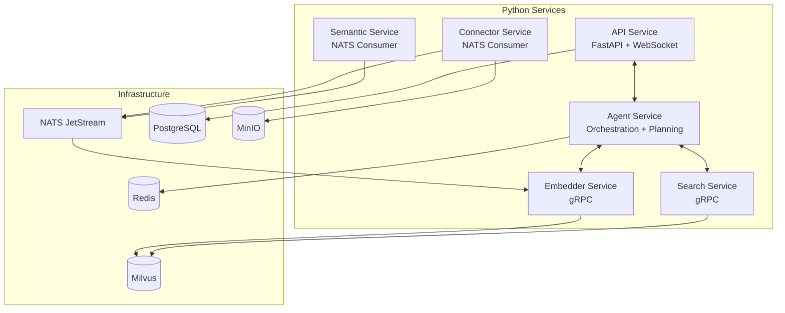

---

## Tech Stack

| Layer | Technology | Rationale |
|-------|------------|-----------|
| **API** | FastAPI + WebSocket | Async, streaming, OpenAPI docs |
| **Agent Framework** | Custom State Machine | Zero external deps, air-gap safe (see below) |
| **Embeddings** | SentenceTransformers | Local, configurable per cluster |
| **Vector DB** | Milvus | Scalable, HNSW/DiskANN indexes |
| **Relational DB** | PostgreSQL | Reliable, JSONB support |
| **Cache/Memory** | Redis | Fast, pub/sub, streams |
| **Object Storage** | MinIO | S3-compatible, self-hosted |
| **Message Queue** | NATS JetStream | Lightweight, persistent |
| **LLM Local** | Ollama / vLLM | Easy deployment, GPU support |
| **LLM Cloud** | OpenAI / Anthropic | Optional, for connected deployments |
| **Auth** | Authentik | SSO, OIDC, self-hosted |
| **Observability** | OpenTelemetry + Grafana | Traces, metrics, logs |

### Air-Gapped Deployment Requirement

EchoMind must support **fully disconnected environments** (e.g., DoD classified networks, SCIF, air-gapped data centers). This drives key architectural decisions:

| Requirement | Solution |
|-------------|----------|
| No internet access | All dependencies pre-packaged, offline installers |
| No telemetry/phone-home | Custom agent framework (no LangChain telemetry) |
| Local LLM only | Ollama/vLLM with pre-downloaded models |
| Local embeddings | SentenceTransformers with cached models |
| No external auth | Authentik self-hosted, LDAP/AD integration |
| Audit compliance | Full request/response logging, no data exfil |

### Why Custom Agent Framework (not LangGraph)

LangGraph is powerful but has concerns for air-gapped:
- LangChain dependencies can attempt network calls
- LangSmith integration is opt-out, not opt-in
- Complex dependency tree harder to audit
- Version pinning doesn't guarantee no network calls

**EchoMind Agent Core** will be a custom state machine:
- Pure Python, zero hidden network calls
- Explicit state transitions, fully auditable
- Same Think→Act→Observe→Reflect pattern
- Can be formally verified if needed

### Embedding Model Configuration

Embedding model is **cluster-wide** and configured via environment variables:

```bash
# .env or ConfigMap
ECHOMIND_EMBEDDING_MODEL=sentence-transformers/paraphrase-multilingual-mpnet-base-v2
ECHOMIND_EMBEDDING_DIMENSION=768
```

**Important**: Changing the embedding model requires:
1. Delete all vectors from Milvus
2. Mark all documents as `pending`
3. Re-scan all data sources
4. Re-embed all documents

This is enforced at startup: if model config changes, system blocks until admin confirms re-indexing.

---

## Deployment Modes

### Single Container (Development)

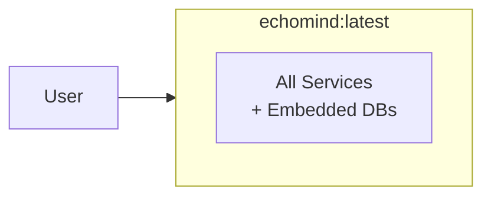

### Docker Compose (Small Scale)

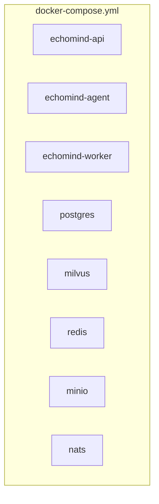

### Kubernetes (Production)

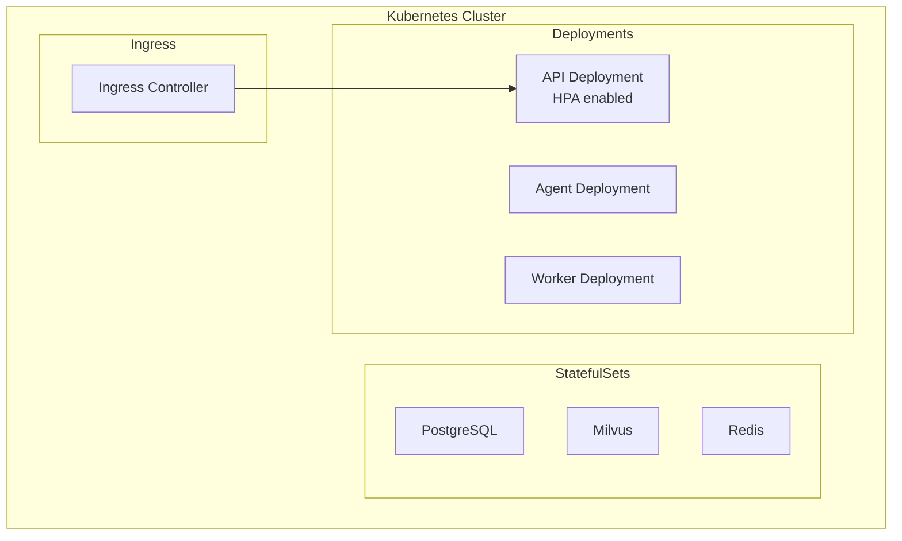

---

## Directory Structure (Proposed)

```
echomind/
├── docs/                    # Documentation
│   ├── architecture.md      # This file
│   └── api/                 # API documentation
├── src/
│   ├── api/                 # FastAPI application
│   │   ├── routes/
│   │   ├── middleware/
│   │   └── websocket/
│   ├── agent/               # Agent core
│   │   ├── orchestrator.py
│   │   ├── planner.py
│   │   ├── memory/
│   │   └── tools/
│   ├── services/            # Background services
│   │   ├── embedder/
│   │   ├── semantic/
│   │   ├── connector/
│   │   └── search/
│   ├── connectors/          # Data source connectors
│   │   ├── onedrive/
│   │   ├── teams/
│   │   ├── web/
│   │   └── file/
│   ├── db/                  # Database clients
│   │   ├── postgres.py
│   │   ├── milvus.py
│   │   ├── redis.py
│   │   └── minio.py
│   ├── models/              # Pydantic models
│   ├── proto/               # gRPC definitions
│   └── lib/                 # Shared utilities
├── deployment/
│   ├── docker/
│   │   ├── Dockerfile
│   │   └── docker-compose.yml
│   └── k8s/
│       └── manifests/
├── config/                  # Configuration files
├── tests/
└── scripts/
```

---

## Next Steps

1. **Phase 1**: Core infrastructure (API, DB connections, auth)
2. **Phase 2**: Document ingestion pipeline (connectors, chunking, embedding)
3. **Phase 3**: Basic RAG (search, retrieval, generation)
4. **Phase 4**: Agent capabilities (planning, memory, tools)
5. **Phase 5**: Production hardening (observability, scaling)

---

## Decisions Made

- [x] **Agent framework**: Custom state machine (air-gap requirement)
- [x] **Embedding model**: Cluster-wide config via env vars, requires re-index on change
- [x] **Deployment targets**: Single container, Docker Compose, Kubernetes
- [x] **LLM strategy**: Local-first (Ollama/vLLM), cloud optional for connected envs
- [x] **Auth**: Authentik (self-hosted, OIDC/LDAP)
- [x] **Tenancy**: Single-tenant with per-user/group/org vector collections

## Open Questions

- [ ] Memory persistence strategy (how long to retain episodic memory?)
- [ ] Tool sandboxing approach (code execution in air-gapped environments)
- [ ] Model packaging strategy (how to ship Ollama models for air-gap?)
- [ ] Offline dependency bundling (pip wheels, Docker images)
