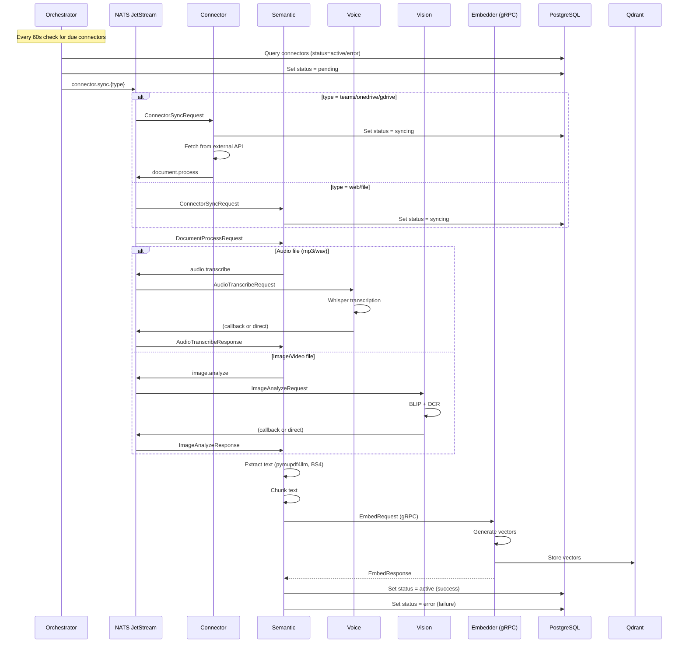

# EchoMind NATS Messaging

> Complete message flow documentation for NATS JetStream communication.

---

## Overview

EchoMind uses NATS JetStream for asynchronous service communication in the document ingestion pipeline. Messages are persistent and support at-least-once delivery.

**Connection URL:** `nats://nats:4222` (internal) or `NATS_URL` env var

---

## Message Flow Diagram



---

## Streams Configuration

### ECHOMIND Stream

Primary stream for document ingestion.

```bash
# Create stream
nats stream add ECHOMIND \
  --subjects "connector.sync.*,document.process,audio.transcribe,image.analyze" \
  --retention limits \
  --max-msgs-per-subject 10000 \
  --max-age 7d \
  --storage file \
  --replicas 1
```

| Setting | Value | Rationale |
|---------|-------|-----------|
| Retention | limits | Remove old messages after max-age |
| Max Age | 7 days | Keep failed messages for debugging |
| Storage | file | Persist across restarts |
| Replicas | 1 | Single node (increase for HA) |

---

## Subjects Reference

### 1. connector.sync.{type}

**Purpose:** Trigger connector sync for a specific data source type.

| Attribute | Value |
|-----------|-------|
| **Publisher** | echomind-orchestrator |
| **Consumer** | echomind-connector (teams, onedrive, gdrive) OR echomind-semantic (web, file) |
| **Payload** | `ConnectorSyncRequest` |
| **Trigger** | APScheduler job (every 60s) |

**Subject Variants:**
- `connector.sync.teams` → Connector Service
- `connector.sync.onedrive` → Connector Service
- `connector.sync.google_drive` → Connector Service
- `connector.sync.web` → Semantic Service
- `connector.sync.file` → Semantic Service

**Payload:** See [Proto Definitions - ConnectorSyncRequest](./proto-definitions.md#connectorsyncrequest)

```json
{
  "connector_id": 123,
  "type": "google_drive",
  "user_id": 42,
  "scope": "group",
  "scope_id": "engineering",
  "config": {"folder_id": "abc123", "access_token": "..."},
  "state": {"delta_cursor": "xyz789"},
  "chunking_session": "uuid-here"
}
```

---

### 2. document.process

**Purpose:** Request document extraction and embedding.

| Attribute | Value |
|-----------|-------|
| **Publisher** | echomind-connector |
| **Consumer** | echomind-semantic |
| **Payload** | `DocumentProcessRequest` |
| **Trigger** | After connector downloads file to MinIO |

**Payload:** See [Proto Definitions - DocumentProcessRequest](./proto-definitions.md#documentprocessrequest)

```json
{
  "document_id": 456,
  "connector_id": 123,
  "url": "minio:documents:abc123.pdf",
  "content_type": "application/pdf",
  "scope": "group",
  "scope_id": "engineering",
  "chunking_session": "uuid-here"
}
```

---

### 3. audio.transcribe

**Purpose:** Request audio transcription via Whisper.

| Attribute | Value |
|-----------|-------|
| **Publisher** | echomind-semantic |
| **Consumer** | echomind-voice |
| **Payload** | `AudioTranscribeRequest` |
| **Trigger** | When semantic service detects audio MIME type |

**Payload:** See [Proto Definitions - AudioTranscribeRequest](./proto-definitions.md#audiotranscriberequest)

```json
{
  "document_id": 789,
  "audio_url": "minio:audio:meeting.mp3",
  "language": "auto",
  "chunking_session": "uuid-here"
}
```

**Response Flow:** Voice service publishes transcript back or writes directly to document record.

---

### 4. image.analyze

**Purpose:** Request image captioning and OCR.

| Attribute | Value |
|-----------|-------|
| **Publisher** | echomind-semantic |
| **Consumer** | echomind-vision |
| **Payload** | `ImageAnalyzeRequest` |
| **Trigger** | When semantic service detects image/video MIME type |

**Payload:** See [Proto Definitions - ImageAnalyzeRequest](./proto-definitions.md#imageanalyzerequest)

```json
{
  "document_id": 101,
  "image_url": "minio:images:diagram.png",
  "extract_text": true,
  "chunking_session": "uuid-here"
}
```

---

## Consumer Groups

Each service uses a durable consumer with queue groups for load balancing.

| Service | Consumer Name | Queue Group |
|---------|---------------|-------------|
| echomind-connector | `connector-consumer` | `connector-workers` |
| echomind-semantic | `semantic-consumer` | `semantic-workers` |
| echomind-voice | `voice-consumer` | `voice-workers` |
| echomind-vision | `vision-consumer` | `vision-workers` |

```python
# Example consumer configuration
subscriber = JetStreamEventSubscriber(
    nats_url="nats://nats:4222",
    stream_name="ECHOMIND",
    subject="document.process",
    durable_name="semantic-consumer",
    queue_group="semantic-workers"
)
```

---

## Message Routing Summary

```
┌─────────────────┐
│  Orchestrator   │
│  (Publisher)    │
└────────┬────────┘
         │
         ▼ connector.sync.{type}
         │
    ┌────┴────┐
    │         │
    ▼         ▼
┌───────┐  ┌──────────┐
│Connector│  │ Semantic │  (web/file go direct)
└────┬───┘  └────┬─────┘
     │           │
     │ document  │
     │ .process  │
     └─────┬─────┘
           │
           ▼
    ┌──────────┐
    │ Semantic │
    └────┬─────┘
         │
    ┌────┼────┐
    │    │    │
    ▼    │    ▼
┌─────┐  │  ┌──────┐
│Voice│  │  │Vision│
└──┬──┘  │  └──┬───┘
   │     │     │
   └─────┼─────┘
         │
         ▼ (text ready)
    ┌──────────┐
    │ Embedder │ (gRPC, not NATS)
    └──────────┘
```

---

## Error Handling

### Message Acknowledgment

| Outcome | Action | Result |
|---------|--------|--------|
| Success | `msg.ack()` | Message removed from queue |
| Temporary failure | `msg.nak()` | Message redelivered after delay |
| Permanent failure | `msg.term()` | Message moved to dead letter |
| Processing | `msg.in_progress()` | Extend ack deadline |

### Dead Letter Queue

Failed messages after max retries go to DLQ:

```bash
nats stream add ECHOMIND_DLQ \
  --subjects "dlq.>" \
  --retention limits \
  --max-age 30d
```

### Retry Policy

```python
# Consumer configuration
max_deliver = 5          # Max redelivery attempts
ack_wait = "30s"         # Ack deadline
backoff = [              # Delay between retries
    "1s",
    "5s",
    "30s",
    "2m",
    "10m"
]
```

---

## Monitoring

### Key Metrics

| Metric | Description |
|--------|-------------|
| `nats_consumer_pending_msgs` | Messages waiting to be processed |
| `nats_consumer_redelivered_msgs` | Messages that were redelivered |
| `nats_consumer_ack_pending` | Messages awaiting acknowledgment |
| `nats_stream_msgs` | Total messages in stream |

### Health Checks

```bash
# Check stream status
nats stream info ECHOMIND

# Check consumer lag
nats consumer info ECHOMIND semantic-consumer

# View pending messages
nats consumer next ECHOMIND semantic-consumer --peek
```

---

## Configuration

### Environment Variables

```bash
# All services
NATS_URL=nats://nats:4222
NATS_STREAM_NAME=ECHOMIND

# Orchestrator (publisher)
ORCHESTRATOR_NATS_SUBJECT_PREFIX=connector.sync

# Connector
CONNECTOR_NATS_SUBJECTS=connector.sync.teams,connector.sync.onedrive,connector.sync.google_drive
CONNECTOR_PUBLISH_SUBJECT=document.process

# Semantic
SEMANTIC_NATS_SUBJECTS=connector.sync.web,connector.sync.file,document.process
SEMANTIC_PUBLISH_AUDIO=audio.transcribe
SEMANTIC_PUBLISH_IMAGE=image.analyze

# Voice
VOICE_NATS_SUBJECTS=audio.transcribe

# Vision
VISION_NATS_SUBJECTS=image.analyze
```

---

## References

- [Proto Definitions](./proto-definitions.md) - Message payload schemas
- [Architecture](./architecture.md) - System overview
- [NATS JetStream Docs](https://docs.nats.io/nats-concepts/jetstream)
