# Embedder Service

> **Service:** `echomind-embedder`
> **Protocol:** gRPC
> **Port:** 50051

---

## What It Does

The Embedder Service **converts text and images into vector embeddings** using NVIDIA models:

- Receives text chunks and images from Ingestor service
- Generates vector embeddings using configured model
- Stores vectors in Qdrant with metadata
- Supports batch processing for efficiency
- Caches models to reduce load time

---

## How It Works

### Architecture


### Embedding Flow

```mermaid
sequenceDiagram
    participant I as Ingestor
    participant E as Embedder
    participant M as Model Cache
    participant Q as Qdrant

    I->>E: EmbedRequest (chunks, model, collection)

    E->>M: Get model
    alt Model in cache
        M-->>E: Cached model
    else Model not cached
        M->>M: Load model
        M-->>E: New model
    end

    E->>E: Encode chunks → vectors
    E->>Q: Upsert points with payloads
    Q-->>E: OK

    E-->>I: EmbedResponse (success)
```



---

## Technology Stack

| Component | Technology |
|-----------|------------|
| gRPC Server | grpcio |
| Embeddings | sentence-transformers |
| Vector DB | qdrant-client |
| GPU Support | CUDA / MPS (Apple Silicon) |

---

## Database Tables Used

This service does **NOT** access PostgreSQL directly. It only writes to Qdrant.

---

## Qdrant Collections

| Collection Pattern | Example | Source |
|-------------------|---------|--------|
| `user_{user_id}` | `user_42` | User-scoped connectors |
| `group_{scope_id}` | `group_engineering` | Group-scoped connectors |
| `org` | `org` | Org-scoped connectors |

### Point Structure

```python
{
    "id": "uuid-here",
    "vector": [0.1, 0.2, ...],  # 768 dimensions (model dependent)
    "payload": {
        "document_id": 123,
        "chunk_index": 0,
        "content": "The quarterly revenue...",
        "title": "Q4 Report.pdf",
        "connector_id": 5,
        "chunking_session": "batch-uuid",
        "created_at": "2025-01-20T10:00:00Z"
    }
}
```

---

## Proto Definitions Used

### gRPC Service Definition

```protobuf
// src/proto/internal/embedding.proto

service EmbedService {
    rpc Embed(EmbedRequest) returns (EmbedResponse);
    rpc EmbedBatch(stream EmbedRequest) returns (stream EmbedResponse);
}

message EmbedRequest {
    repeated string contents = 1;          // Text chunks
    string model = 2;                      // Model name
    string collection_name = 3;            // Qdrant collection
    int32 document_id = 4;
    repeated ChunkMetadata metadata = 5;   // Per-chunk metadata
}

message ChunkMetadata {
    int32 chunk_index = 1;
    string title = 2;
    int32 connector_id = 3;
    string chunking_session = 4;
}

message EmbedResponse {
    bool success = 1;
    int32 vectors_stored = 2;
    string error = 3;
}
```

See [Proto Definitions](../proto-definitions.md#embedrequest--embedresponse)

---

## NATS Messaging

**This service does NOT use NATS.** Communication is synchronous via gRPC:

| Direction | Protocol | Peer |
|-----------|----------|------|
| Incoming | gRPC | echomind-ingestor |
| Outgoing | Qdrant client | Qdrant |

---

## Model Caching

```python
class SentenceEncoder:
    """Thread-safe model cache for SentenceTransformers."""

    _cache_limit = int(os.getenv('MODEL_CACHE_LIMIT', 1))
    _lock = threading.Lock()
    _model_cache: dict[str, SentenceTransformer] = {}

    @classmethod
    def _get_model(cls, model_name: str) -> SentenceTransformer:
        with cls._lock:
            if model_name in cls._model_cache:
                return cls._model_cache[model_name]

            # Evict oldest if at limit
            if len(cls._model_cache) >= cls._cache_limit:
                oldest = next(iter(cls._model_cache))
                del cls._model_cache[oldest]
                logger.info(f"🗑️ Evicted model: {oldest}")

            # Load new model
            logger.info(f"📥 Loading model: {model_name}")
            model = SentenceTransformer(model_name)
            cls._model_cache[model_name] = model
            return model

    @classmethod
    def embed_batch(cls, texts: list[str], model_name: str) -> list[list[float]]:
        model = cls._get_model(model_name)
        embeddings = model.encode(texts, show_progress_bar=False)
        return [e.tolist() for e in embeddings]
```

---

## Service Structure

```
src/embedder/
├── __init__.py             # Package marker
├── main.py                 # gRPC server entry + servicer
├── config.py               # Pydantic settings
├── Dockerfile              # Container build
├── pyproject.toml          # Dependencies
└── logic/
    ├── __init__.py
    ├── encoder.py          # SentenceEncoder with caching
    └── exceptions.py       # Domain exceptions
```

---

## Configuration

```bash
# gRPC Server
EMBEDDER_GRPC_HOST=0.0.0.0
EMBEDDER_GRPC_PORT=50051

# Embedding Model
# NVIDIA embedding model: 1B params, 2048 dim, ~2-4GB VRAM (BF16)
ECHOMIND_EMBEDDING_MODEL=nvidia/llama-nemotron-embed-1b-v2
ECHOMIND_EMBEDDING_DIMENSION=2048

# Model Cache
MODEL_CACHE_LIMIT=1          # Max models in memory

# Qdrant
QDRANT_HOST=qdrant
QDRANT_PORT=6333

# GPU
CUDA_VISIBLE_DEVICES=0       # GPU index (empty for CPU)
```

---

## GPU Support

The service auto-detects available hardware:

```python
from echomind_lib.helpers.device_checker import DeviceChecker

def serve():
    DeviceChecker.check_device()
    # Logs: "🖥️ Using device: cuda:0" or "🍎 Using device: mps" or "💻 Using device: cpu"
```

| Device | Detection |
|--------|-----------|
| NVIDIA GPU | `torch.cuda.is_available()` |
| Apple Silicon | `torch.backends.mps.is_available()` |
| CPU | Fallback |

---

## Batch Processing

For large documents, chunks are processed in batches:

```python
BATCH_SIZE = 32

async def embed_document(chunks: list[str], model: str) -> list[list[float]]:
    embeddings = []
    for i in range(0, len(chunks), BATCH_SIZE):
        batch = chunks[i:i + BATCH_SIZE]
        batch_embeddings = SentenceEncoder.embed_batch(batch, model)
        embeddings.extend(batch_embeddings)
    return embeddings
```

---

## Health Check

```bash
# gRPC health check
grpc_health_probe -addr=:50051

# HTTP (optional)
GET :8080/healthz

# Response
{
  "status": "healthy",
  "qdrant": "connected",
  "model_loaded": "nvidia/llama-nemotron-embed-1b-v2",
  "device": "cuda:0"
}
```

---

## Performance Considerations

| Factor | Recommendation |
|--------|----------------|
| Model loading | Cache models; avoid reloading |
| Batch size | 32-64 chunks per batch |
| GPU memory | Monitor with `nvidia-smi` |
| Qdrant writes | Use batch upsert |

---

## Unit Testing (MANDATORY)

All service logic MUST have unit tests. See [Testing Standards](../../.claude/rules/testing.md).

### Test Location

```
tests/unit/embedder/
├── test_embed_servicer.py
├── test_sentence_encoder.py
└── test_qdrant_writer.py
```

### What to Test

| Component | Test Coverage |
|-----------|---------------|
| EmbedServicer | gRPC request handling |
| SentenceEncoder | Model caching, batch encoding |
| QdrantWriter | Point creation, batch upsert |

### Example

```python
# tests/unit/embedder/test_sentence_encoder.py
class TestSentenceEncoder:
    @pytest.fixture
    def mock_model(self):
        model = MagicMock()
        model.encode.return_value = [np.array([0.1, 0.2, 0.3])]
        return model

    def test_embed_batch_returns_list_of_floats(self, mock_model):
        with patch("sentence_transformers.SentenceTransformer", return_value=mock_model):
            result = SentenceEncoder.embed_batch(["hello"], "model-name")

        assert len(result) == 1
        assert isinstance(result[0], list)
        assert all(isinstance(x, float) for x in result[0])

    def test_caches_model_after_first_load(self, mock_model):
        with patch("sentence_transformers.SentenceTransformer", return_value=mock_model) as mock_ctor:
            SentenceEncoder.embed_batch(["a"], "cached-model")
            SentenceEncoder.embed_batch(["b"], "cached-model")

        # Model constructor called only once
        assert mock_ctor.call_count == 1
```

### Minimum Coverage

- **70%** for service classes
- **80%** for encoder logic

---

## References

- [Proto Definitions](../proto-definitions.md) - Message schemas
- [Architecture](../architecture.md) - System overview
- [Ingestor Service](./ingestor-service.md) - Sends EmbedRequest
- [NVIDIA Embedding Models](https://huggingface.co/nvidia/llama-3.2-nv-embedqa-1b-v2) - Text embedding
- [NVIDIA VLM Embedding](https://huggingface.co/nvidia/llama-3.2-nemoretriever-1b-vlm-embed-v1) - Multimodal embedding
