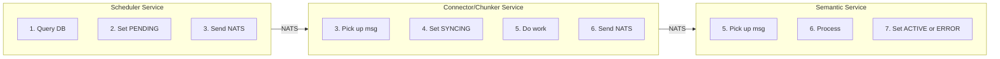
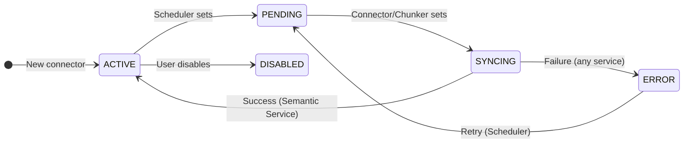
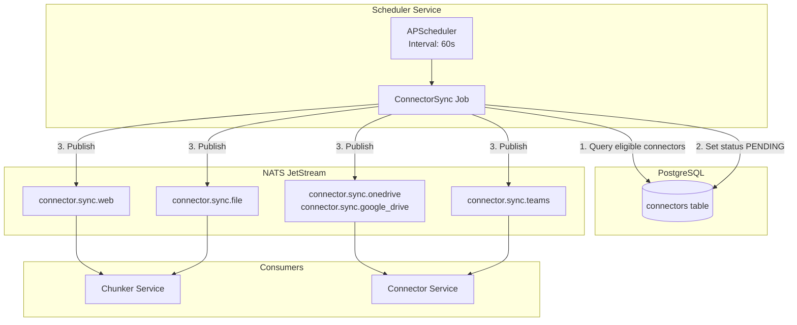
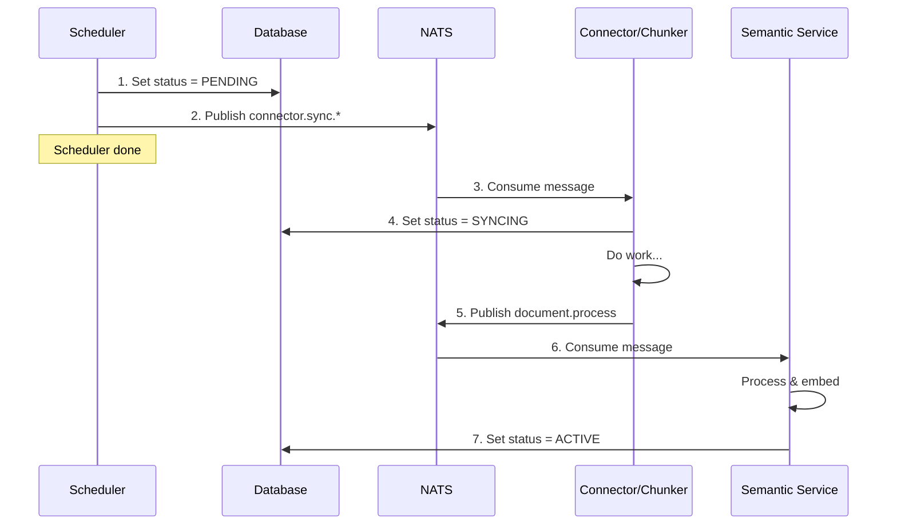

# Scheduler Service Proposal

> **Status**: Draft
> **Technology**: APScheduler
> **Location**: `src/services/scheduler/`

---

## Overview

The Scheduler Service is a **lightweight trigger service** that monitors the database and sends NATS messages when work needs to be done. It does NOT execute any business logic itself.

**What it does:**
- Query the database for connectors due for sync
- Update connector status to `PENDING`
- Publish a message to NATS

**What it does NOT do:**
- Fetch data from external sources
- Process documents
- Update status to `SYNCING`, `ACTIVE`, or `ERROR` (other services do this)

---

## Responsibility Boundaries



| Action | Responsible Service |
|--------|---------------------|
| Set status to `PENDING` | Scheduler |
| Set status to `SYNCING` | Connector/Chunker Service |
| Set status to `ACTIVE` | Semantic Service (on success) |
| Set status to `ERROR` | Any service (on failure) |

---

## Core Responsibilities

### 1. Connector Sync Check

Query the `connectors` table for rows that need sync:

| Field | Purpose |
|-------|---------|
| `status` | Trigger if `ACTIVE` (ready) or `ERROR` (can retry). Skip if `PENDING`, `SYNCING`, or `DISABLED` |
| `refresh_freq_minutes` | Interval between syncs (null = manual only) |
| `last_sync_at` | Calculate next run time |
| `type` | Determines routing (Connector vs Chunker) |

### 2. Refresh Rules by Connector Type

Based on EchoMind's `ConnectorType` enum from `src/proto/public/connector.proto`:

| Connector Type | Default Refresh | Route To | Behavior |
|----------------|-----------------|----------|----------|
| `web` | 7 days | Chunker (direct) | Full re-crawl |
| `file` | One-time | Chunker (direct) | Manual upload, no refresh |
| `onedrive` | 7 days | Connector Service | Delta sync (changed files) |
| `google_drive` | 7 days | Connector Service | Delta sync (changed files) |
| `teams` | 1 day | Connector Service | Incremental (new messages) |

### 3. Status Flow

Uses EchoMind's `ConnectorStatus` enum from `src/proto/public/connector.proto`:



**Statuses that ALLOW scheduling:**
- `ACTIVE` - Ready for sync (check refresh_freq_minutes + last_sync_at)
- `ERROR` - Failed, can retry

**Statuses that BLOCK scheduling:**
- `PENDING` - Already queued, waiting for worker
- `SYNCING` - Currently processing
- `DISABLED` - User disabled connector

---

## Architecture



---

## Job Types

### 1. ConnectorSyncJob (Primary)

Runs every minute, checks for connectors due for sync:

```python
async def connector_sync_check() -> None:
    """
    Check for connectors that need synchronization.

    For each connector due for sync:
    1. Update status to PENDING
    2. Publish NATS message

    Does NOT wait for response or do any processing.
    """
    now = datetime.utcnow()

    # Find connectors eligible for sync:
    # - Status is ACTIVE (ready) or ERROR (can retry)
    # - refresh_freq_minutes is set (not manual-only)
    # - last_sync_at + refresh_freq_minutes <= now
    connectors = await db.execute(
        select(Connector)
        .where(Connector.status.in_(["active", "error"]))
        .where(Connector.refresh_freq_minutes.isnot(None))
        .where(
            or_(
                Connector.last_sync_at.is_(None),
                Connector.last_sync_at +
                    func.make_interval(mins=Connector.refresh_freq_minutes) <= now
            )
        )
    )

    for connector in connectors.scalars():
        # 1. Update status to PENDING
        await db.execute(
            update(Connector)
            .where(Connector.id == connector.id)
            .values(status="pending")
        )
        await db.commit()

        # 2. Generate chunking session ID
        chunking_session = str(uuid.uuid4())

        # 3. Publish NATS message (fire-and-forget)
        subject = f"connector.sync.{connector.type}"
        await nats.publish(subject, ConnectorSyncRequest(
            connector_id=connector.id,
            type=connector.type,
            user_id=connector.user_id,
            scope=connector.scope,
            scope_id=connector.scope_id,
            config=connector.config,
            state=connector.state,
            chunking_session=chunking_session,
        ))

        logger.info("📤 Triggered sync for connector %s (session: %s)",
                    connector.id, chunking_session)
```

---

## Integration with Existing Services

### Message Flow (Fire-and-Forget)

The scheduler publishes and moves on. It does NOT wait for responses.



### NATS Subjects

| Subject | Publisher | Consumer | Payload |
|---------|-----------|----------|---------|
| `connector.sync.web` | Scheduler | Chunker | `ConnectorSyncRequest` |
| `connector.sync.file` | Scheduler | Chunker | `ConnectorSyncRequest` |
| `connector.sync.onedrive` | Scheduler | Connector Service | `ConnectorSyncRequest` |
| `connector.sync.google_drive` | Scheduler | Connector Service | `ConnectorSyncRequest` |
| `connector.sync.teams` | Scheduler | Connector Service | `ConnectorSyncRequest` |
| `document.process` | Connector Service | Semantic Service | `DocumentProcessRequest` |

**Note:** The scheduler does NOT subscribe to any subjects. It only publishes.

---

## Proto Messages

The scheduler uses **internal** proto messages for NATS communication. These are defined in `src/proto/internal/scheduler.proto`.

### ConnectorSyncRequest

Message sent by the scheduler to trigger a connector sync.

```protobuf
// src/proto/internal/scheduler.proto

syntax = "proto3";

package echomind.internal;

option go_package = "echomind/proto/internal";

import "google/protobuf/struct.proto";
import "public/connector.proto";

// Sent by Scheduler to trigger a connector sync
message ConnectorSyncRequest {
    // Connector ID (from connectors table)
    int32 connector_id = 1;

    // Connector type (reuse from public proto)
    echomind.public.ConnectorType type = 2;

    // User who owns the connector
    int32 user_id = 3;

    // Scope for vector collection routing
    echomind.public.ConnectorScope scope = 4;

    // Group name if scope=GROUP (determines collection: group_{scope_id})
    optional string scope_id = 5;

    // Connector-specific configuration (credentials, paths, etc.)
    google.protobuf.Struct config = 6;

    // Sync state (cursors, tokens, pagination state)
    google.protobuf.Struct state = 7;

    // Session ID for tracking this sync batch (generated by scheduler)
    string chunking_session = 8;
}
```

### Existing Enums (from `public/connector.proto`)

The scheduler reuses enums already defined in EchoMind:

```protobuf
// ConnectorType - from src/proto/public/connector.proto
enum ConnectorType {
    CONNECTOR_TYPE_UNSPECIFIED = 0;
    CONNECTOR_TYPE_TEAMS = 1;
    CONNECTOR_TYPE_GOOGLE_DRIVE = 2;
    CONNECTOR_TYPE_ONEDRIVE = 3;
    CONNECTOR_TYPE_WEB = 4;
    CONNECTOR_TYPE_FILE = 5;
}

// ConnectorStatus - from src/proto/public/connector.proto
enum ConnectorStatus {
    CONNECTOR_STATUS_UNSPECIFIED = 0;
    CONNECTOR_STATUS_PENDING = 1;   // Scheduler sets this
    CONNECTOR_STATUS_SYNCING = 2;   // Connector/Chunker sets this
    CONNECTOR_STATUS_ACTIVE = 3;    // Semantic service sets this (success)
    CONNECTOR_STATUS_ERROR = 4;     // Any service sets this (failure)
    CONNECTOR_STATUS_DISABLED = 5;  // User disabled
}

// ConnectorScope - from src/proto/public/connector.proto
enum ConnectorScope {
    CONNECTOR_SCOPE_UNSPECIFIED = 0;
    CONNECTOR_SCOPE_USER = 1;   // Collection: user_{user_id}
    CONNECTOR_SCOPE_GROUP = 2;  // Collection: group_{scope_id}
    CONNECTOR_SCOPE_ORG = 3;    // Collection: org
}
```

### Collection Name Resolution

The consuming service derives the collection name from scope:

```python
def get_collection_name(user_id: int, scope: str, scope_id: str | None) -> str:
    """
    Derive Qdrant collection name from connector scope.

    Args:
        user_id: Owner's user ID
        scope: One of 'user', 'group', 'org'
        scope_id: Group name if scope is 'group'

    Returns:
        Collection name for Qdrant
    """
    match scope:
        case "user":
            return f"user_{user_id}"
        case "group":
            return f"group_{scope_id}"
        case "org":
            return "org"
        case _:
            raise ValueError(f"Invalid scope: {scope}")
```

---

## Database Schema

### Job Store Table (APScheduler)

```sql
-- Created automatically by APScheduler SQLAlchemyJobStore
CREATE TABLE apscheduler_jobs (
    id VARCHAR(191) PRIMARY KEY,
    next_run_time FLOAT,
    job_state BYTEA NOT NULL
);

CREATE INDEX ix_apscheduler_jobs_next_run_time
    ON apscheduler_jobs (next_run_time);
```

### Scheduler Audit Table (Custom)

```sql
CREATE TABLE scheduler_runs (
    id UUID PRIMARY KEY DEFAULT gen_random_uuid(),
    job_name VARCHAR(100) NOT NULL,
    connector_id UUID REFERENCES connectors(id),
    started_at TIMESTAMP NOT NULL DEFAULT NOW(),
    completed_at TIMESTAMP,
    status VARCHAR(20) NOT NULL, -- 'running', 'completed', 'failed'
    error_message TEXT,
    documents_processed INT DEFAULT 0
);

CREATE INDEX idx_scheduler_runs_connector
    ON scheduler_runs (connector_id, started_at DESC);
```

---

## Configuration

### Environment Variables

```bash
# Scheduler Settings
SCHEDULER_ENABLED=true
SCHEDULER_CHECK_INTERVAL_SECONDS=60
SCHEDULER_MAX_CONCURRENT_SYNCS=5
SCHEDULER_JOB_STORE_URL=${DATABASE_URL}

# Default Refresh Intervals (minutes)
SCHEDULER_DEFAULT_REFRESH_WEB=10080       # 7 days
SCHEDULER_DEFAULT_REFRESH_DRIVE=10080     # 7 days
SCHEDULER_DEFAULT_REFRESH_CHAT=1440       # 1 day
SCHEDULER_DEFAULT_REFRESH_FILE=0          # Never (one-time)
```

---

## Service Structure

```
src/services/scheduler/
├── __init__.py
├── main.py                 # Entry point
├── logic/
│   ├── __init__.py
│   ├── scheduler_service.py    # Core scheduling logic
│   ├── jobs/
│   │   ├── __init__.py
│   │   ├── connector_sync.py   # Connector sync job
│   │   ├── cleanup.py          # Cleanup job
│   │   └── health_check.py     # Health check job
│   └── exceptions.py           # Domain exceptions
├── middleware/
│   └── error_handler.py
└── config.py               # Service configuration
```

---

## Implementation Phases

### Phase 1: Core Scheduler (MVP)
- [ ] APScheduler setup with PostgreSQL job store
- [ ] Connector sync check job (every minute)
- [ ] Update connector status to PENDING
- [ ] NATS publisher for sync triggers
- [ ] Basic health endpoint (`/healthz`)
- [ ] Docker Compose integration

### Phase 2: Production Ready
- [ ] Metrics export (Prometheus)
- [ ] Leader election for K8s (only one scheduler runs)
- [ ] Helm chart
- [ ] ConfigMap/Secret integration

---

## High Availability

### Single Instance (Docker Compose)
- Simple: one scheduler container
- Job store in PostgreSQL ensures jobs persist across restarts

### Multiple Instances (Kubernetes)
- **Leader Election**: Use PostgreSQL advisory locks or Kubernetes Lease API
- Only the leader executes jobs
- Followers remain on standby for failover

```python
# Leader election with PostgreSQL advisory lock
async def acquire_leadership():
    result = await db.execute(
        text("SELECT pg_try_advisory_lock(12345)")
    )
    return result.scalar()
```

---

## Observability

### Logging (Emoji Convention)

```python
logger.info("🕐 Scheduler started")
logger.info("🔍 Checking connectors for sync...")
logger.info("📤 Triggered sync for connector %s", connector_id)
logger.info("✅ Sync completed for connector %s", connector_id)
logger.error("❌ Sync failed for connector %s: %s", connector_id, error)
logger.warning("⏭️ Skipping connector %s (already syncing)", connector_id)
```

### Metrics

| Metric | Type | Description |
|--------|------|-------------|
| `scheduler_jobs_total` | Counter | Total jobs executed |
| `scheduler_jobs_failed` | Counter | Failed job executions |
| `scheduler_sync_duration_seconds` | Histogram | Sync job duration |
| `scheduler_pending_syncs` | Gauge | Connectors waiting for sync |

---

## Dependencies

```toml
# pyproject.toml additions
[project.dependencies]
apscheduler = "^3.10"
sqlalchemy = "^2.0"  # Already in echomind_lib
nats-py = "^2.0"     # Already in echomind_lib
```

---

## Open Questions

1. **How to handle stuck connectors?**
   - If a connector stays in `PENDING` or `SYNCING` for too long, should the scheduler reset it?
   - Or should another service (health monitor) handle this?

2. **Manual trigger via API?**
   - Should the main API have an endpoint to manually trigger a sync?
   - This would bypass the scheduler and directly publish to NATS

---

## References

- [APScheduler Documentation](https://apscheduler.readthedocs.io/)
- [EchoMind Architecture](./architecture.md)
- [Cognix Orchestrator Pattern](../sample/docs/golang/orchestrator.md)